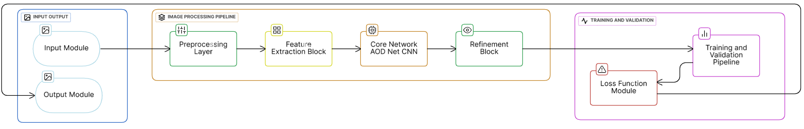
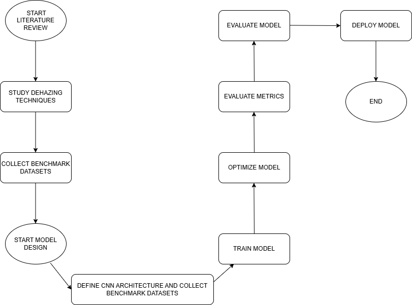
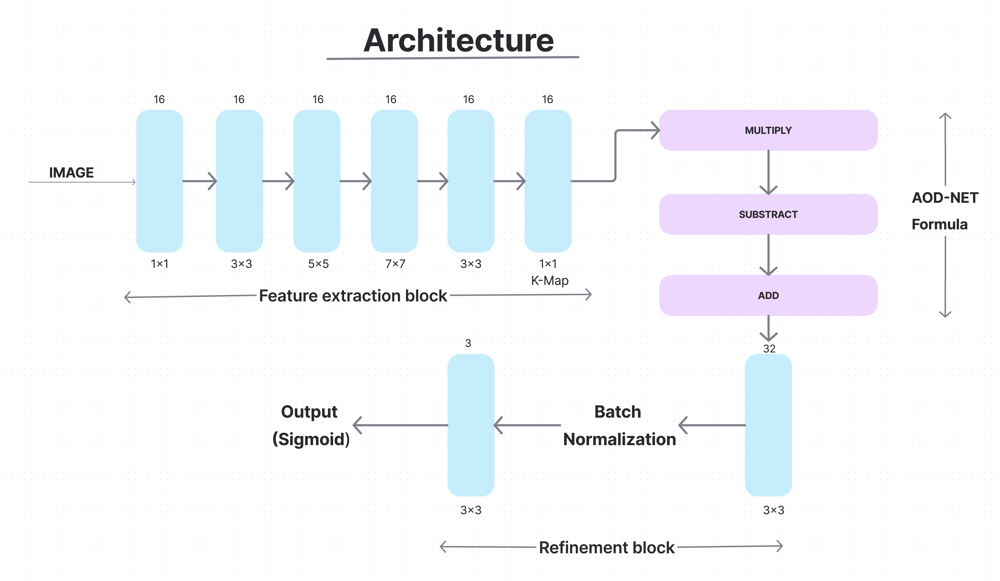
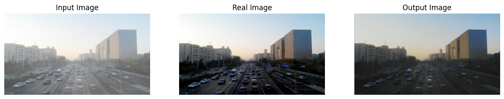
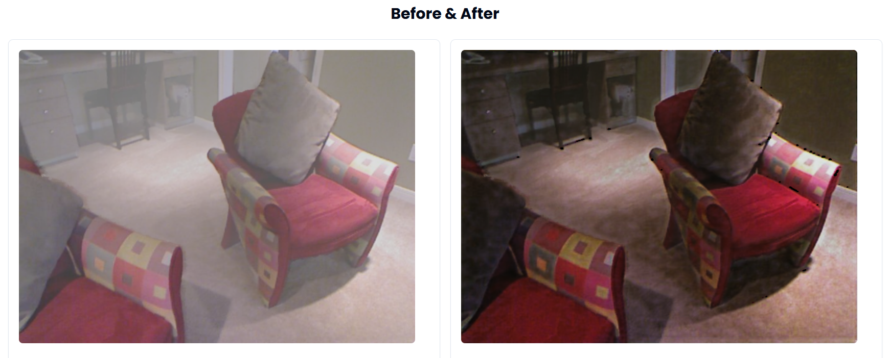
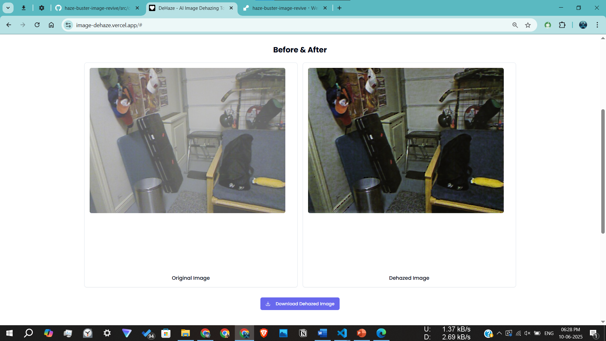

# 🌫️ Haze Buster - Lightweight Hybrid CNN for Real-Time Image Dehazing with Perceptual Loss Optimization

A lightweight and robust image dehazing web application powered by a refined hybrid CNN model inspired by AOD-Net.


## Project Overview

**Haze Buster** is an end-to-end AI-based system that removes haze from real-world images using a custom-built deep learning model. The model enhances visibility in hazy images, trained on RESIDE's dataset and deployed via a FastAPI backend for real-time image dehazing.

<a href="https://image-dehaze.vercel.app/" target="_blank">
  
</a>


## 🚀 Key Features

- 🔧 **Custom Lightweight CNN Model**: Designed for real-time image dehazing using dynamic input dimensions.
- 📊 **Refined Architecture**: Combines multi-scale feature extraction, AOD-Net formulation, and refinement blocks.
- 🌐 **REST API Backend**: Built using FastAPI and integrated with TensorFlow for serving predictions.
- 🧪 **High Accuracy Metrics**: Achieved excellent **PSNR** and **SSIM** values with optimized loss curves.
- 📸 **End-to-End Workflow**: From dataset preprocessing to live inference through web interface.


## Model Architecture

### 1. Full Pipeline Overview



### 2. Methodology

<p align="center">
  
</p>

### 2. Detailed CNN Architecture



- **Input Layer**: Accepts RGB images of any size `(None, None, 3)`.
- **Multi-Scale Feature Extraction Block**: Series of 1×1, 3×3, 5×5, and 7×7 convolutions.
- **AOD-Net Inspired Formula**: Applies the formula `J(x) = K(x) * I(x) - K(x) + 1` for transmission map estimation.
- **Refinement Block**: 2-layer convolution with batch normalization.
- **Output Layer**: Sigmoid activation for image reconstruction in the 0–1 range.


## Training Performance

### 1. Loss (MSE) vs Epoch Graph

<!--
🔁 How to URL-encode a path (like for mse graph): Replace space ( ) → %20
-->


- **Training Loss**: Steadily decreasing trend, indicating proper learning.
- **Validation Loss**: Shows generalization with acceptable fluctuation.
- **Number of Epochs Trained**: 48

## 2. Evaluation Metrics

- **Loss Function**: Mean Squared Error (MSE)
  ```
         1
  MSE = ─── * ∑(Yᵢ - Ŷᵢ)²
         n

  Where, Yᵢ and Ŷᵢ denote the ground truth and predicted pixel values respectively, and n is the total number of pixels.
  ```

- **Peak Signal-to-Noise Ratio (PSNR)**: `> 60 dB` on validation set
  ```
                     MAX²
  PSNR = 10 * log₁₀ ──────
                     MSE
  Where,
  - MAX is the highest possible intensity value a pixel can have in the image
  - Mean Squared Error (MSE) is used both as a standalone loss function and for PSNR calculation.
  ```

- **Structural Similarity Index (SSIM)**: `Around 0.76 - 0.78` (on test samples)
  ```
                     (2 * μₓ * μᵧ + C₁) * (2 * σₓᵧ + C₂)   
      SSIM(x, y) =  ─────────────────────────────────────  
                     (μₓ² + μᵧ² + C₁) * (σₓ² + σᵧ² + C₂) 

  Where:  
  - μₓ, μᵧ = Means of the two images  
  - σₓ², σᵧ² = Variances of the two images  
  - σₓᵧ = Covariance between the images  
  - C₁, C₂ = Constants for stability
  ```


## 🖥️ Tech Stack

| Layer         | Technology                   |
|---------------|------------------------------|
| Frontend      | React, Tailwind CSS          |
| Backend API   | FastAPI, Python, TensorFlow  |
| Model         | AOD-Net (Refined Keras)      |
| Deep Learning | TensorFlow + Keras |
| Utilities  | Python, NumPy, Pillow, OpenCV |
| Frontend Deployment   | Vercel              |
| Backend Deployment    | Render               |


## API Endpoint
- **POST** /dehaze
- **Accepts**: .png, .jpg, .jpeg
- **Returns**: Dehazed image in image/png format

## Training Info
- **Dataset**: `RESIDE - ITS` (Indoor Training Set) || `Reside - SOTS` ,  `I-HAZE` & `D-HAZE` are removed for now
- Data Split: `80:10:10`
  - **80%** → Training Set  
  - **10%** → Validation Set  
  - **10%** → Testing Set
- **Training Images per Epoch**: `13,000+`
- **Trainable Parameters**: `1,54,308` (602.77 KB)
- **Training Platform**: `Google Colab` (T4 GPU)
- **Batch Size**: `1` (to preserve image quality)
- **Floating Point Operations (FLOPs)**: `6,727,598,272` (6.7B+ FLOPs or 6727.60 MFLOPs)
  ```
  FLOPs = FLOPs = 2 × Kₕ × Kₓ × Cᵢₙ × Hₒᵤₜ × Wₒᵤₜ × Cₒᵤₜ
  ```
- **Dynamic Image Size Support**: Accepts RGB images of any size `(None, None, 3)`.
- **Model saved as**: `aod_net_refined.keras`

## Team Contributions

| Name                                  | Contribution Areas                                          |
|-------------------------------------- | ---------------------------------------------------------- |
| **Sai Pritam Panda** *(Group Leader)* | Data cleaning, preprocessing, model architecture design, training, backend integration |
| **Debi Prasad Mahakud**               | Model implementation, backend setup, error handling        |
| **Prabhat Sharma**                    | Research analysis, debugging, frontend planning            |
| **Hrishikesh Swain**                  | Data collection, frontend prototyping                      |

## 📈 Project Results

- ✅ **Model Performance:**
  - Final Training Loss: **Consistently low MSE**
  - PSNR: **Above 60 dB** on validation set
  - SSIM: **Approximately 0.76 to 0.78**, indicating high structural similarity with ground truth

- 📊 **Training Insights:**
  - Smooth convergence with minimal overfitting
  - Training graph available: `mse_vs_epoch_graph.png`
  - Detailed training logs available in `training_log.txt`
  
- 📁 **Output Samples:**
  - Real image and dehazed image comparisons
  - Dehazed Images can be downloaded, if viewed in the website
  
- ⚡ **Deployment:**
  - Fast, real-time inference using FastAPI backend
  - Supports dynamic image input sizes for flexible usage

### 1. After AOD-NET Implementation



### 2. After AOD-NET Modification



### 3. Website




## 📄 License
This project is released under the MIT License.
